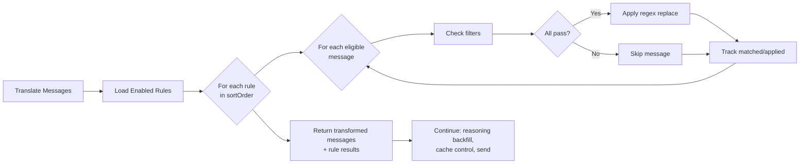

# Content Rules Reference

Content Rules are ordered regex-based transformations applied to system and
user messages before the first assistant response. Configure them in the
**Content Rules** section of the TokenGuard Copilot settings panel.

## Table of Contents

- [How Rules Are Applied](#how-rules-are-applied)
- [Field Reference](#field-reference)
- [Matching Logic](#matching-logic)
- [Capture Group Substitution](#capture-group-substitution)
- [Regex Flags Reference](#regex-flags-reference)
- [Common Recipes](#common-recipes)
- [Debugging Rules](#debugging-rules)

## How Rules Are Applied

Rules run as part of the chat message processing pipeline, after VS Code
message parts have been translated to OpenAI-format messages and before
reasoning backfill and cache control injection:



Key behaviors:

- **Sequential application**: Rules are applied in `sortOrder`. Each rule's
  output becomes the next rule's input. This means later rules see the
  results of earlier rules.
- **First-assistant boundary**: Only messages that appear **before** the
  first `assistant` role message are eligible. Messages after the first
  assistant response (multi-turn conversation) are untouched. If no
  assistant message exists, all messages are eligible.
- **Non-string content**: Messages whose content is an array of image parts
  (non-string content) are skipped.
- **Disabled rules**: Rules with `enabled = false` are completely skipped
  during processing — they are not loaded.

## Field Reference

| Field | Required | Default | Description |
| --- | --- | --- | --- |
| Name | Yes | — | Display name, must be unique among all rules |
| Enabled | No | `true` | Whether the rule participates in processing |
| Match Role | No | `all` | `system`, `user`, or `all` (both) |
| Match Message Number | No | (all) | 0-based index; only that exact message position matches |
| Match Model Pattern | No | (all) | Glob/wildcard pattern (e.g., `gpt-4*`, `*deepseek*`) |
| Match Content Pattern | No | (all) | Regex; must match the message content (uses same flags as the find-replace regex) |
| Match Tools Present | No | (all) | Comma-separated tool names in the form (matched as a set); ALL must be present (AND logic) |
| Match Tools Absent | No | (all) | Comma-separated tool names in the form (matched as a set); ALL must be absent (AND logic) |
| Regex Pattern | Yes | — | JavaScript regex for find-replace |
| Regex Flags | No | `gm` | Flags: `g` (global), `i` (ignore case), `m` (multiline), `s` (dotAll) |
| Substitution | No | `""` | Replacement string; supports `$1`–`$n` capture group references |
| Sort Order | Auto | — | Position in the ordered list; managed by reorder buttons |

## Matching Logic

All non-null/empty matching criteria use **AND** logic — every criterion must
pass for a message to match. If **any** single criterion fails, the rule skips
that message.

How each criterion is evaluated:

- **Match Role**: Exact string comparison. If set to `system`, only system
  messages match. If set to `user`, only user messages match. If set to
  `all` (or empty), both match.
- **Match Message Number**: Exact integer comparison against the message's
  0-based position in the list (0 = first message, typically the system
  prompt).
- **Match Model Pattern**: Glob/wildcard matching against the model ID.
  Uses `*` for any sequence of characters (e.g., `gpt-4*` matches
  `gpt-4o`, `gpt-4-turbo`, etc.).
- **Match Content Pattern**: `RegExp.test()` against the message content
  string. The regex is compiled using the same flags as the find-replace
  regex (the **Regex Flags** field).
- **Match Tools Present**: Each tool name entered (comma-separated in the
  form) is checked against the set of available tools. ALL must be present.
- **Match Tools Absent**: Each tool name is checked against the set of
  available tools. ALL must be absent.

Null or empty fields act as **"match all"** for that criterion — they do not
restrict which messages the rule applies to.

## Capture Group Substitution

The substitution string supports standard JavaScript capture group references
(`$1`, `$2`, ..., `$n`) that refer to parenthesized groups in the regex
pattern. `$&` refers to the entire matched substring.

**Example**: Wrap matched text in XML tags:

- **Regex pattern**: `(system prompt content)`
- **Substitution**: `<$1>`
- **Input**: `This is system prompt content for the model.`
- **Output**: `This is <system prompt content> for the model.`

With the `g` flag, this applies to every match in the message. Without `g`,
only the first match is replaced.

## Regex Flags Reference

| Flag | Name | Effect |
| --- | --- | --- |
| `g` | Global | Replace all matches in the string, not just the first |
| `i` | Ignore case | Case-insensitive matching (`[A-Z]` matches `a` too) |
| `m` | Multiline | `^` and `$` match start/end of each line, not just the whole string |
| `s` | dotAll | `.` matches newline characters (`\n`, `\r`) |

The default flags are `gm` (global + multiline), which is the most
useful combination for transforming multi-line messages.

## Common Recipes

### Strip Redundant Built-in Skills

Removes the `<skill>` blocks for redundant built-in skills from the
system prompt.

```text
Name:           Strip redundant built-in skills
Match role:     system
Regex pattern:  <skill>[\s]*?<name>(project-setup-info-local|get-search-view-results|agent-customization)<\/name>[\s\S]*?<\/skill>
Substitution:   (empty)
```

### Remove Memory Instructions (When Memory Tool Absent)

Removes `<memoryInstructions>...</memoryInstructions>` from the system prompt,
but only when the `memory` tool is not available.

```text
Name:                Remove unused memory instructions
Match role:          system
Match tools absent:  memory
Regex pattern:       <memoryInstructions>[\s\S]*?<\/memoryInstructions>
Substitution:        (empty)
```

### Prefix Injection

Prepends a custom instruction to every system message.

```text
Name:           Add system prefix
Match role:     system
Regex pattern:  ^(.*)
Regex flags:    gms
Substitution:   You are an expert programming assistant. $1.
```

This uses the `gms` flag so `^` matches the start of the prompt.

## Debugging Rules

Use the **Chat Debug Log** to verify your rules are working as expected:

1. **Enable debug logging**: Run **TokenGuard Copilot: Enable Debugging
   Logging** from the Command Palette (`Cmd+Shift+P`).
2. **Send a chat request**: Use Copilot Chat with a model that has Content
   Rules configured.
3. **Open the debug log**: In the TokenGuard Logs tree view (Explorer
   sidebar), expand the latest session and open the log file.
4. **Check the `contentRules` section**: Each enabled rule is listed with
   three flags:
   - `matched: true` — the rule's criteria matched at least one message.
   - `applied: true` — the regex actually changed message content (at least
     one replacement occurred).
   - `errored: true` — the regex pattern is invalid. Check your regex
     syntax.
5. **Compare messages**: The log shows message content **after** rules have
   been applied. Compare with what you expected. If a rule didn't fire:
   - Is `enabled` toggled on?
   - Does the message appear **before** the first assistant response?
   - Are all match criteria satisfied?
   - If using `Match Content Pattern`, remember it uses the same flags as
     the find-replace regex.
